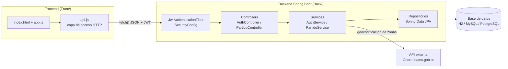
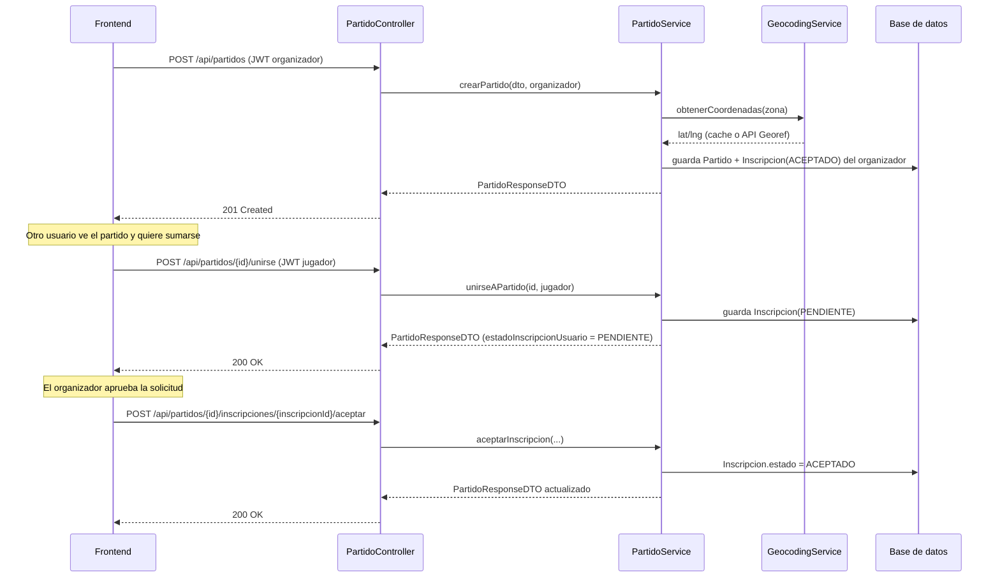

# Arquitectura

## Visión general

CuartaPala sigue una arquitectura cliente-servidor clásica: un frontend SPA en JavaScript vanilla que consume una API REST stateless construida con Spring Boot, respaldada por una base de datos relacional.

## Capas del backend

| Capa | Paquete | Responsabilidad |
|---|---|---|
| Controller | `com.padelconnect.controller` | Expone los endpoints REST, valida el `@RequestBody` con Bean Validation y delega en los services. No contiene lógica de negocio. |
| Service | `com.padelconnect.service` | Lógica de negocio: reglas de cupos, estados de inscripción, geocodificación, cálculo de distancias (Haversine). |
| Repository | `com.padelconnect.repository` | Interfaces `JpaRepository` con *query methods* derivados (Spring Data JPA genera el SQL). |
| Entity | `com.padelconnect.entity` | Mapeo objeto-relacional (JPA/Hibernate) de las tablas `usuarios`, `partidos`, `inscripciones`. |
| DTO | `com.padelconnect.dto` | Objetos de transferencia que desacoplan el modelo persistente del contrato de la API. |
| Config | `com.padelconnect.config` | Seguridad (JWT, CORS), internacionalización de mensajes de validación/error. |
| Exception | `com.padelconnect.exception` | Excepciones de negocio + `@RestControllerAdvice` central que las traduce a respuestas HTTP homogéneas. |

## Seguridad y autenticación

- **JWT stateless**: al hacer login o registro, `AuthService` genera un token firmado (HS512, `JwtTokenProvider`) con el email del usuario como *subject* y expiración configurable (24 h por defecto).
- **`JwtAuthenticationFilter`**: intercepta cada request, valida el header `Authorization: Bearer <token>` y, si es válido, carga al `Usuario` correspondiente en el `SecurityContext` (rol único `ROLE_USER`).
- **`SecurityConfig`**: define qué rutas son públicas (`/api/auth/register`, `/api/auth/login`, listado y detalle de partidos vía `GET`) y cuáles requieren autenticación (crear partido, unirse, aceptar/rechazar, salir, `/mis-partidos`). Sesión `STATELESS` (sin cookies de sesión del lado servidor).
- **Contraseñas**: hasheadas con BCrypt (`PasswordEncoder`), nunca se devuelven en las respuestas (los DTO no incluyen el campo `password`).

## Internacionalización (i18n)

Los mensajes de validación y de error (`messages.properties` / `messages_en.properties`) están externalizados y se resuelven según el header `Accept-Language` de la request (`AcceptHeaderLocaleResolver`, default `es`). Cubierto por `I18nValidationTest`.

## Flujo de datos: crear y unirse a un partido

## Frontend

El frontend no usa framework ni build step: es HTML + CSS + JS cargado directo por el navegador.

- **`api.js`** — capa única de acceso a la API (`ApiService`). Centraliza `fetch()`, headers de autenticación (`Authorization: Bearer`), y normaliza la forma de los datos que devuelve el backend real para que el resto de la app trabaje siempre con la misma estructura (ver `normalizeMatch`).
- **`app.js`** — lógica de UI: render de listados, modales, formularios, filtros, y manejo de eventos. No hace `fetch()` directo, siempre pasa por `ApiService`.
- **Modo offline/demo**: si el backend no responde (`fetch` falla por red), `ApiService` cae a un modo de persistencia local en `localStorage` (`mockData.js`) para poder seguir demostrando la interfaz sin backend levantado. Este modo es solo una demostración visual — no reemplaza al backend real.
