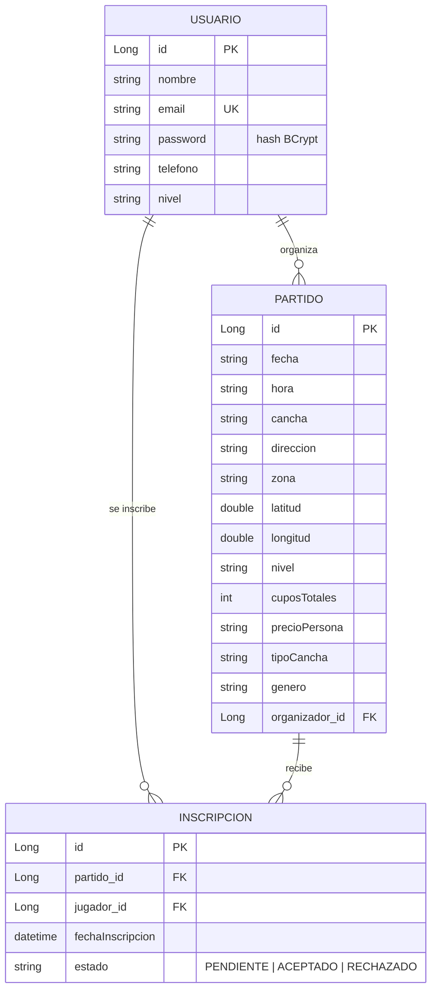
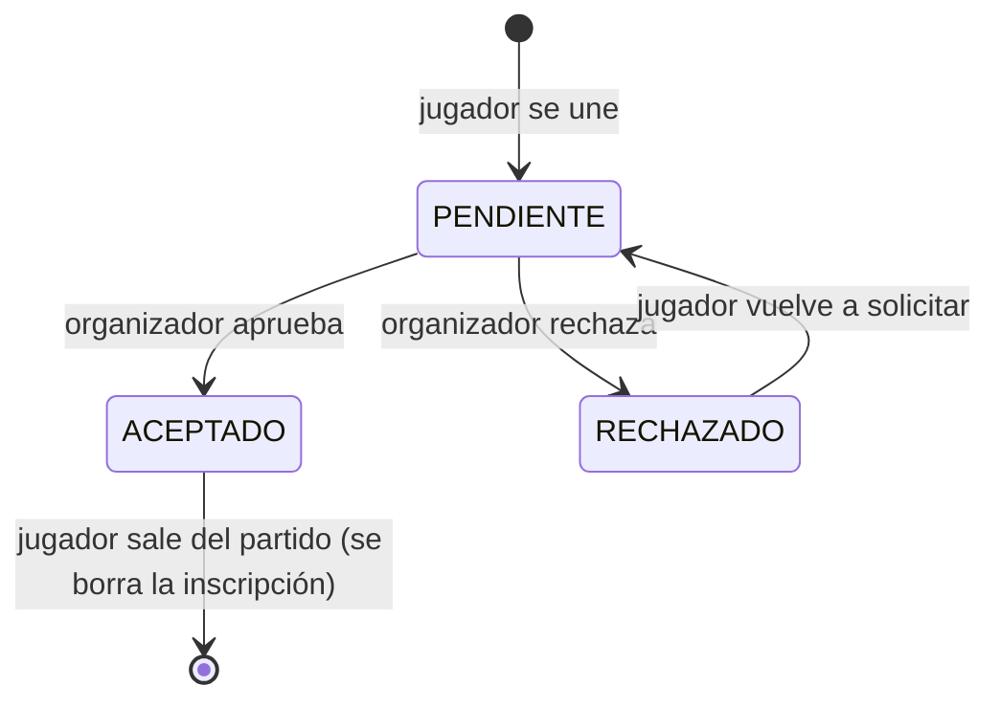

# Modelo de datos

El esquema se genera automáticamente por Hibernate (`ddl-auto: update`) a partir de las entidades JPA — no hay scripts SQL manuales que mantener.

## Diagrama entidad-relación

## Entidades

### `Usuario` (tabla `usuarios`)

Representa a una persona registrada. El email es único (`unique = true`) y actúa como identificador de login. La contraseña nunca se expone: los DTOs (`UserDto`) sólo exponen `id`, `nombre`, `email`, `telefono`, `nivel` y `avatarIniciales` (calculado a partir del nombre, no persistido).

### `Partido` (tabla `partidos`)

Un partido de pádel publicado por un `organizador` (`@ManyToOne` a `Usuario`, `FetchType.EAGER`). `cuposTotales` es fijo al crear el partido; la cantidad de cupos *disponibles* y de *jugadores faltantes* **no se persiste** — se recalcula en cada respuesta a partir de las inscripciones `ACEPTADO` existentes (`PartidoService.buildPartidoResponseDTO`), evitando inconsistencias entre el contador y la realidad de las inscripciones.

### `Inscripcion` (tabla `inscripciones`)

Relaciona un `Usuario` (jugador) con un `Partido`, con una restricción `UNIQUE(partido_id, jugador_id)` — un usuario no puede tener dos inscripciones activas al mismo partido. Su `estado` (enum `EstadoInscripcion`) modela el flujo de aprobación:

El organizador **no** tiene una fila especial: al crear el partido se le genera automáticamente una `Inscripcion` propia con estado `ACEPTADO`, así que consultas como "cupos disponibles" o "listado de jugadores confirmados" no necesitan tratarlo como caso especial.

## Reglas de negocio relevantes

- **Cupos**: `cuposDisponibles = cuposTotales − inscripciones en estado ACEPTADO`. Unirse o aceptar una inscripción cuando `cuposDisponibles <= 0` devuelve `409 Conflict` (`CupoLlenoException`).
- **Re-solicitud tras rechazo**: si un usuario fue `RECHAZADO` y vuelve a pedir unirse, su misma fila de `Inscripcion` se reutiliza y pasa a `PENDIENTE` (no se crea una fila duplicada, respetando la constraint única).
- **Geocodificación con caché**: `GeocodingService` mantiene un diccionario en memoria de zonas ya resueltas (además de ~20 zonas precargadas del Gran Buenos Aires y otras ciudades) para no golpear la API pública de Georef en cada request.

## Perfiles de base de datos

| Perfil | Cuándo se usa | Configuración |
|---|---|---|
| *(default, sin perfil activo)* | Desarrollo y evaluación sin instalar nada | H2 en memoria (`application.yml`), se recrea vacía en cada arranque. |
| `mysql` | Persistencia real en desarrollo local | `application-mysql.yml` — requiere una base `padelconnect_db` en `localhost:3306`. |
| `postgres` | Producción (Supabase) | `application-postgres.yml` — pensado para PostgreSQL, local o gestionado (Supabase). |

Los tres perfiles conviven sin pisarse. Ver [INSTALACION.md](INSTALACION.md) para el despliegue en Render + Supabase.
