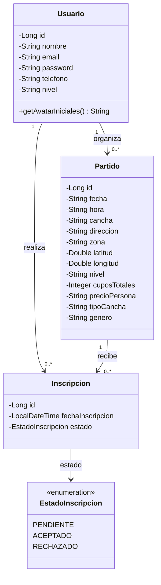
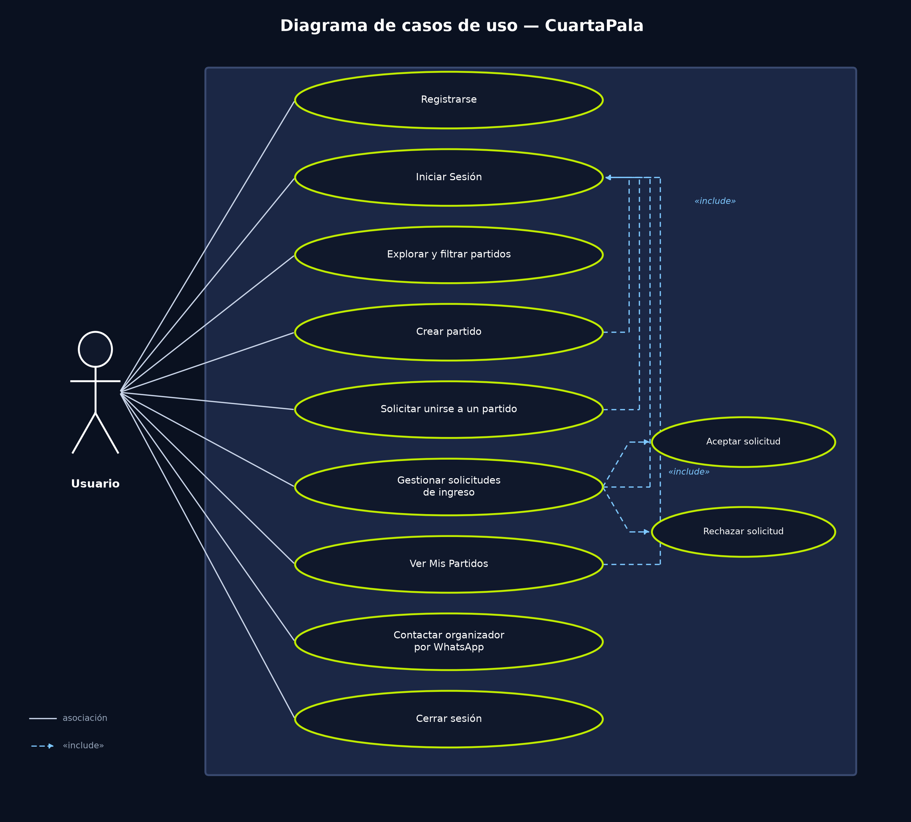

# Diagramas

Complementa a [BASE_DE_DATOS.md](BASE_DE_DATOS.md) (modelo de datos / diagrama entidad-relación) con el diagrama de clases y el de casos de uso.

## Diagrama de clases

Modelo de dominio orientado a objetos del backend: las clases de entidad (JPA), sus atributos y las relaciones entre ellas. Es el mismo modelo que Hibernate traduce automáticamente al esquema relacional.

Usuario se relaciona con Partido a través de "organiza" (un usuario puede organizar muchos partidos) y con Inscripcion a través de "realiza" (un usuario puede tener muchas inscripciones, a distintos partidos). Partido se relaciona con Inscripcion mediante "recibe". El atributo `estado` de `Inscripcion` toma valores del enumerado `EstadoInscripcion`.

## Diagrama de casos de uso

Existe un único tipo de actor, **Usuario**: la aplicación no distingue roles fijos de "organizador" y "jugador" a nivel de cuenta — cualquier usuario autenticado puede crear un partido (y así ser su organizador) o solicitar sumarse a uno creado por otro (y así ser jugador). "Explorar y filtrar partidos" es el único caso de uso accesible sin autenticación; el resto requiere haber iniciado sesión.

| Caso de uso | Descripción | Precondición |
|---|---|---|
| Registrarse | Crear una cuenta nueva con nombre, email, teléfono, nivel de juego y contraseña. | No tener cuenta con ese email. |
| Iniciar sesión | Autenticarse con email y contraseña para obtener un token JWT. | Tener una cuenta creada. |
| Explorar y filtrar partidos | Ver el listado de partidos disponibles, filtrando por zona, fecha, nivel, género o cercanía. | Ninguna (acceso público). |
| Crear partido | Publicar un partido nuevo indicando cancha, zona, fecha, hora, nivel, género, cupos y precio. | Sesión iniciada. |
| Solicitar unirse a un partido | Pedir un cupo en un partido publicado por otro usuario. | Sesión iniciada; el partido no debe estar lleno. |
| Gestionar solicitudes de ingreso | Ver, aceptar o rechazar las solicitudes pendientes de un partido propio. | Sesión iniciada; ser el organizador del partido. |
| Ver Mis Partidos | Ver los partidos creados y aquellos a los que el usuario se unió. | Sesión iniciada. |
| Contactar organizador por WhatsApp | Abrir un chat de WhatsApp con el organizador de un partido confirmado. | Tener una inscripción confirmada o ser el organizador. |
| Cerrar sesión | Invalidar la sesión activa en el cliente y volver al estado no autenticado. | Sesión iniciada. |

## Diagrama de base de datos

Ver [BASE_DE_DATOS.md](BASE_DE_DATOS.md) — incluye el diagrama entidad-relación (formato Mermaid, con claves primarias/foráneas y cardinalidades) y las reglas de negocio asociadas al modelo.
